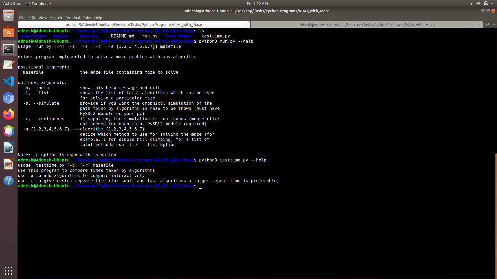
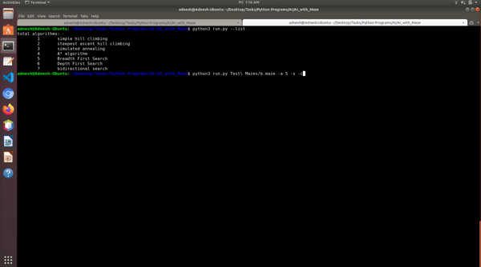
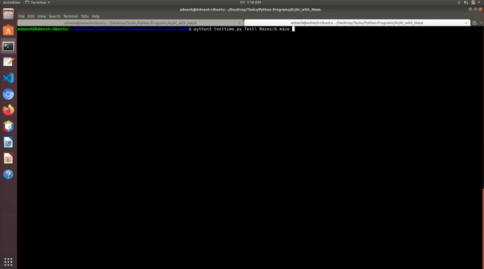
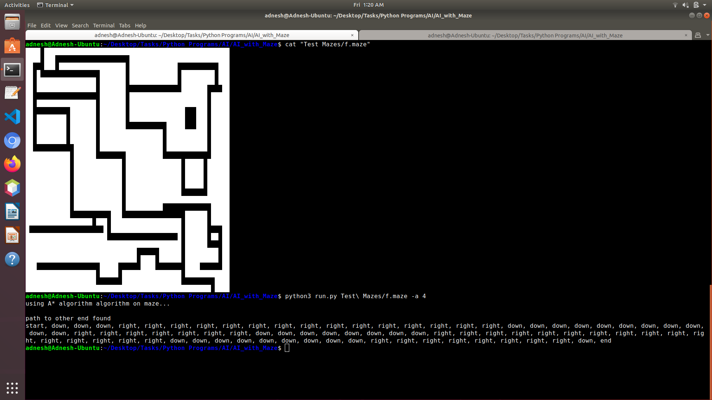

# AI_with_Maze
All the artificial intelligence algorithms implemented in Python for maze problem

I hope this repository becomes useful to anyone who wants to learn and compare how different algorithms in artificial intelligence produce solution to same problem. Users can understand how an algorithm will behave and also compare times taken by different algorithms with the help of graphs.

## Introduction
I implemented some algorithms used in AI like simple hill climbing, steepest ascent hill climbing, simulated annealing etc. Also, carried out their time analysis and also graphical simulation of them

## Before starting
Some python libraries need to be installed before continuing the repository:

- matplotlib - for plotting graphs
- sdl2 - for graphical simulation (optional)
- timeit - for measuring times (must come preinstalled with python)
- numpy - for analysis purpose

## Using this repository
Each algorithm can be itself run by python3 with optional simulation with (-s) option (Read more by reading help - give --help option). 



One test maze file must be provided to each. You can use the mazes in 'Test Maze' folder. 
For example for simulated annealing, use

`python3 simulatedannealing.py --simulate --continuous ../Test\ Mazes/f.maze`



and it will show simulation of a sprite going through the maze to the end of the maze as far as it can go.
without --simulate and --continuous options, it will print the path on the console.

There is also a common run.py file which gives access to all the algorithms. The number of a particular algorithm is specified after which it performs the search on maze w.r.t. the selected algorithm/ For example,

`python3 run.py --simulate --continuous -a 1 Test\ Mazes/d.maze`

This will use simple hill climbing for solving the maze.

For comparing the time taken on the particular maze by algorithms, use testtime.py. You can modify it to some extent to compare only specific algorithms. You may provide more than one maze to testtime.py. It will give you time comparison by plotting bar graphs for each of the algorithms.
For example to test running times of all algorithms on each maze in 'Test Maze' folder, use

`python3 testtime.py Test\ Mazes/*.maze`



and it will show you the bar graphs for the time taken by each algorithm for each maze.

You can even change which algorithms to compare particularly if you change the list in testtime.py. Open testtime.py for more information. All the code can be changed to some extent but full flexibility is not tested.

## Creating your own mazes
You may create your own mazes for testing taking into consideration the following things - 
1. The number of columns in each row must be same i.e. maze must be perfectly rectangular
2. There must not be any preceding or following blank lines
3. There should be an entry through the first row and an exit through the last row
4. It is not necessary, but it is nice if maze has a path from entry and exit. If not, many algorithms will give the path which is nearest to the exit
5. You may use any character for wall i.e. blockage (preferably a character like 'x', 'X', 'O', '*') and a space for passage

A sample maze file would be - 

foo.maze
```
XXXXXXXXXXX XXXXXXXXXXXXXXXXXXXXX
XX               XXXXXXXXXXXXXXXX
XXXXX XXXXXXXXXX            XXXXX
XXXXX XXXXXXXXXX XXXXXXXXXX XXXXX
XXXXX      XXXXX XXXXXXXXXX  XXXX
XXXXXXXXXX XXXXX XXXXXXXXXXX XXXX
XXXXXXXXX  XXXXX         XXX   XX
XXXX      XXXXXXXXXXXXX XXXXXXXXX
XXXX XXXXXXXXXXXXXX     XXXXXXXXX
XXXXXXXXXXXXXXXXXXX XXXXXXXXXXXXX
XXXXXXXXXXXXXXXXXXX XXXXXXXXXXXXX
```



## Use your own search algorithm
To define your own search algorithm, you may use the maze_t class provided here in this code. Use get_maze, main, run_simulation from this repository. Use nextstate, is_better functions for checking next states and whether a state is better than another state or not respectively. The full documentation of various functions is provided in this repository.

Inside the algorithms directory, create your own file like `foo.py`, define your own search method in it and import it in `__init__.py`.

The `foo.py` created by you is then directly included run.py and given a number. You may test `foo.py` for a particular maze.

Then to test its performance w.r.t. another algorithms, add foo in tuple named algorithms in `testtime.py` and give the name 'my foo method' in ticklables. Run testtime.py to compare the time taken by your method vs other methods. 
